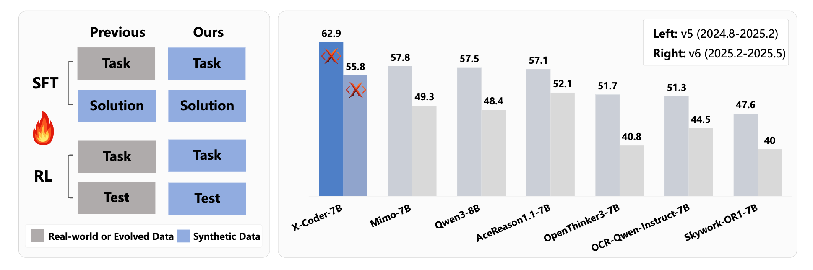
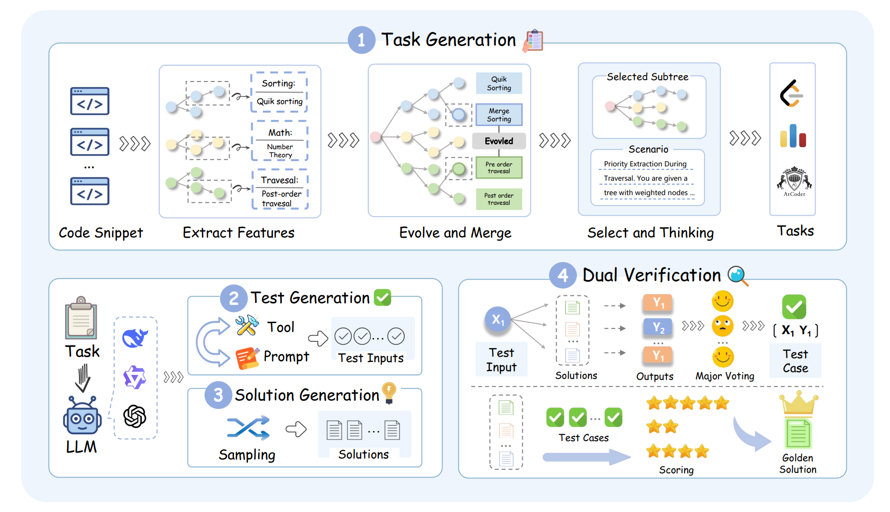
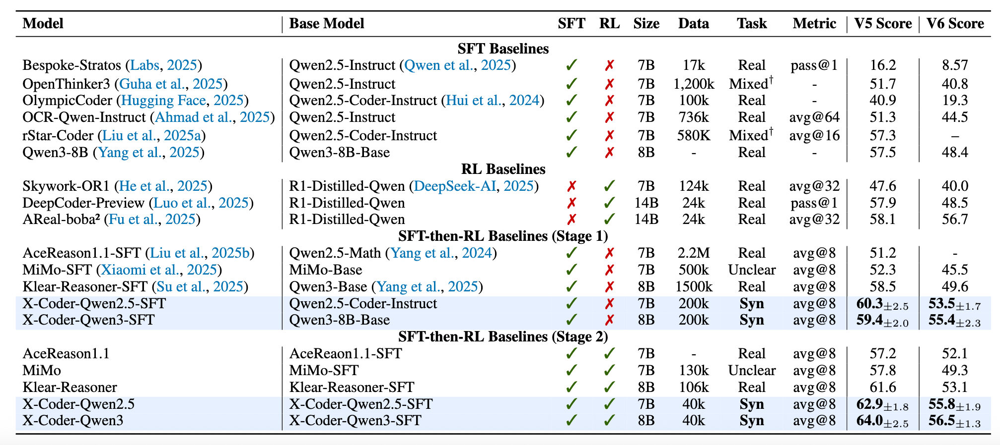

<p align="center">
  
</p>

<h1 align="center">X-Coder: Advancing Competitive Programming with Fully Synthetic Tasks, Solutions, and Tests</h1>

<p align="center">
  <b><a href="https://jiewu02.github.io/">Jie Wu</a><sup>*</sup>, <a href="https://scholar.google.com/citations?user=uQm86UUAAAAJ">Haoling Li</a><sup>*</sup>, <a href="https://scholar.google.com/citations?user=qVmmxogAAAAJ">Xin Zhang</a><sup>†‡</sup>, <a href="https://scholar.google.com/citations?user=fZ4lXDoAAAAJ">Jiani Guo</a>, Jane Luo, Steven Liu, <a href="https://www.microsoft.com/en-us/research/people/yanghuan/">Yangyu Huang</a>, <a href="https://ruihang-chu.github.io/">Ruihang Chu</a><sup>‡</sup>, <a href="https://www.microsoft.com/en-us/research/people/scarli/">Scarlett Li</a>, <a href="https://www.sigs.tsinghua.edu.cn/yyj_en/main.htm">Yujiu Yang</a></b>
</p>

<p align="center">
  <sub><sup>*</sup>Equal Contribution &nbsp;&nbsp; <sup>†</sup>Project Lead &nbsp;&nbsp; <sup>‡</sup>Corresponding Author</sub>
</p>

<p align="center">
  Tsinghua University &nbsp;|&nbsp; Microsoft
</p>

<p align="center">
  <a href="https://huggingface.co/IIGroup/X-Coder-SFT-Qwen3-8B"></a> &nbsp;
  <a href="https://huggingface.co/datasets/IIGroup/X-Coder-SFT-376k"></a> &nbsp;
  <a href="https://huggingface.co/datasets/IIGroup/X-Coder-RL-40k"></a> &nbsp;
  <a href="https://openreview.net/forum?id=jp4dzBilqH"></a>
</p>

---

<p align="center">
  
</p>

**Left:** SynthSmith generates high-quality synthetic tasks, solutions, and test cases to support both SFT and RL training. **Right:** Avg@8 results on LiveCodeBench. X-Coder achieves significant performance gains on competitive programming using fully synthetic data.

---

- [Pipeline](#pipeline)
- [Results](#results)
- [SFT Training](#sft-training)
- [RLVR Training](#rlvr-training)
- [Citation](#citation)

## Pipeline

<p align="center">
  
</p>

**Framework of SynthSmith.** SynthSmith first extracts and evolves competitive programming related features from small-scale code instruction data and merges them into tree structures. It then samples subtrees from the feature tree, selects a compatible feature set, and formulates a scenario that naturally integrates these consistent features. Novel tasks are generated based on a proposed scenario according to specific styles. Advanced reasoning models are used to synthesize solutions and tests for the generated tasks, which are further cross-verified using the proposed dual-verification strategy to yield reliable test outputs and the top solution.

## Results

<p align="center">
  
</p>

**Performance on LiveCodeBench v5.** X-Coder shows strong coding expertise with fewer, fully synthetic tasks, and achieves additional gains through subsequent RL stages.

## SFT Training

SFT training can be performed using various frameworks such as [ms-swift](https://github.com/modelscope/ms-swift), [LLaMA-Factory](https://github.com/hiyouga/LLaMA-Factory), or [Megatron-LM](https://github.com/NVIDIA/Megatron-LM). Below we provide a simple example using ms-swift.

### Environment Setup

```bash
pip install ms-swift -U
```

### Data Preparation

Download and convert the SFT training data from HuggingFace:

```bash
cd sft-recipe
python download_and_convert_data.py
```

This will download [IIGroup/X-Coder-SFT-376k](https://huggingface.co/datasets/IIGroup/X-Coder-SFT-376k) and convert it to `hybrid_376k.jsonl` format with `query` and `response` fields.

### Start SFT Training

For multi-node training (8 nodes x 8 GPUs):

```bash
# On each node, set the appropriate environment variables:
export NODE_RANK=<node_rank>  # 0, 1, 2, ..., 7
export MASTER_ADDR=<master_node_ip>
export MASTER_PORT=29500

cd sft-recipe
bash train_sft.sh
```

For single-node training, modify `train_sft.sh`:
- Set `NNODES=1`
- Adjust `CUDA_VISIBLE_DEVICES` as needed

---

## RLVR Training

### RLVR Quick Start

```bash
# 1. Clone the repository
git clone https://github.com/JieWu02/X-Coder.git
cd X-Coder

# 2. Start Docker container
sudo docker run -it --rm \
  --gpus all \
  --ipc=host \
  -v $(pwd):/workspace \
  whatcanyousee/verl:ngc-cu124-vllm0.8.5-sglang0.4.6.post5-mcore0.12.1-te2.3-deepseekv3 \
  /bin/bash

# 3. Install dependencies
pip install sandbox_fusion pyext
cd rl-recipe

# 4. Download rl training data
python download_data.py

# 5. Start training
bash train_scripts/install.sh
bash train_scripts/xcoder-rl-train.sh
```

### RL Data Preparation

The rl training data (~17GB total) is hosted on HuggingFace: [IIGroup/X-Coder-RL-40k](https://huggingface.co/datasets/IIGroup/X-Coder-RL-40k)

#### Download RL Data

```bash
cd rl-recipe

# Download all data (~17GB)
python download_data.py

# Or download only synthetic data (~8.5GB)
python download_data.py --syn-only
```

#### Data Structure

After downloading, the data will be organized as:

```
rl-recipe/
├── syn_rl_data/
│   └── xcoder_data/
│       └── sorted_by_passrate/
│           ├── part_0000.parquet
│           ├── part_0001.parquet
│           ├── part_0002.parquet
│           ├── part_0003.parquet
│           └── rl_tasks_easy.parquet
└── real_rl_data/
    └── non_sys_prompt/
        ├── codeforces_9763.parquet
        ├── klear_code.parquet
        ├── leetcode_2772.parquet
        ├── taco_13064.parquet
        └── test_wo_prompt.parquet
```

### Code Judge

A code execution and evaluation service is included in `rl-recipe/code-judge/`.

## Citation

If you find this work helpful, please cite:

```bibtex
@inproceedings{
anonymous2025xcoder,
title={X-Coder: Advancing Competitive Programming with Fully Synthetic Tasks, Solutions, and Tests},
author={Anonymous},
booktitle={Submitted to The Fourteenth International Conference on Learning Representations},
year={2025},
url={https://openreview.net/forum?id=jp4dzBilqH},
note={under review}
}
```

## License

This project is licensed under the Apache License 2.0.


